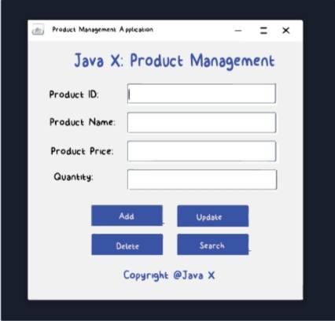
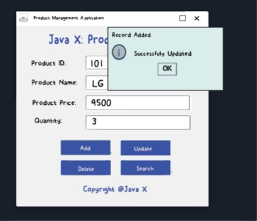
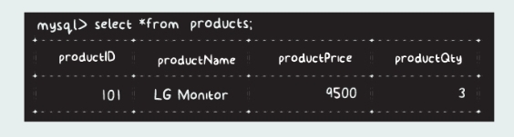
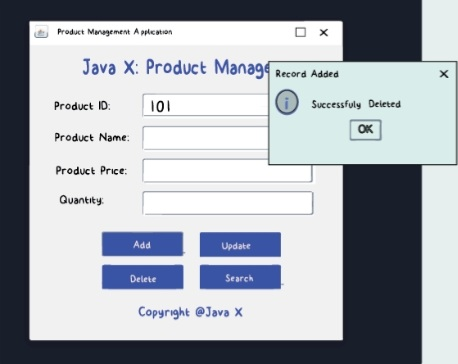
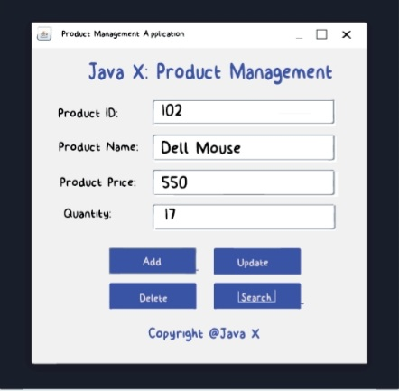

## Updating Product

We are done with the 'add products' functionality. Now let's move ahead and implement the 'update products' functionality.

There are situations where we might need to update the data such as if the price of the product has changed, or there is a change in the product quantity, and more.

Understand that, the product ID is unique since it's a primary key. Therefore, we can access other details using the ID as the primary key.

But before we move ahead, let's have a look at some MySQL theory on how we can update the data using the UPDATE statement.
Updating Values

## Updating Values
We can update the data in MySQL using the UPDATE statement. It helps to modify any field value of any MySQL table. Following is the syntax of the UPDATE statement,

Here, we can specify any condition using the WHERE clause. The WHERE clause will help us to update the values by targeting specific IDs in our products table.

Now that we know how the UPDATE statement works, let's have a look at the logic.

### Logic

The logic is quite simple! Just like in the 'add' functionality, the very first step will be to create a database connection by making a call to the connect() method.

Once we have created the database connection, we will get the values entered by the user in the JTextField's using the getText() method and update those values into the products table of our ProductData database using the update statement.

Based on the productID given by the user, we will use the WHERE clause and update the other values for that particular productID.

Again, the values will be dynamic in nature, hence, instead of using the Statement, we will need to use the PreparedStatement. Finally, once the operation is completed, we will display a dialog box with an appropriate message.
Done

Simple, right?

## Updation code
Refer to Complete.Java file

Just like the 'add' functionality, once we update the values into the database, we clear the data from the text fields using the setText() method. Also, on the successful data update, we show a message dialog box with a success message.

Now, let's move ahead and try to execute it.

Once you enter some data into the fields and hit 'Update', above is how it would look. Yay! It's working...

We have updated the price of the product with ID as '101' from 9000 to 9500. We can verify that using the 'select *' statement in our MySQL command-line.

It should produce output something like below,

&

## Deleting Product

We are done with adding and updating products functionality. Now, let's move to the next one - Delete products functionality.

We will create a logic that will delete the data permanently from the database when the delete button is clicked.

The idea is pretty simple: while performing the delete operation, we would accept only the productID from the user. Based on that productID, we will delete the data using the WHERE clause.

Sounds simple? Let's do it...

Again refer to Complete.Java file

Pretty simple? Right.

Once we enter the productID and hit the Delete button, above is how it would look. We can also go to our MySQL command-line and hit the 'select *' statement to verify that.

It should produce the below output,

&

## Searching Product

All the other functionalities are ready and seem to be working fine...

Now, let's work with the Search operation which will fetch the details from the database and show it to the user.

The idea is pretty simple. We would accept only the productID from the user. Based on that productID, we will fetch other fields with the help of the SELECT statement using the WHERE clause and put the data in the respective text fields using the setText() method.

Sounds simple? Let's do it...

Refer to Complete.Java file

As we know, the select statement will return the ResultSet object using which we can retrieve the data based on the column names. Once we have the data, we simply set that as the text for the text fields.

Also, we have made a check using the if statement to ensure that the data for that particular productID exists.

#### Note: If you are following this tutorial, your products tables will be empty since we had only one row and we deleted it in the last section. Therefore, before executing the above part, add some data to the table.

Let's try and fetch some values from our database.

Enter the productID as 102 and hit the Search button. It should produce the output as shown above... [Of course the retrieved data would be as per the entry made into the database]

That's it for this section! We are done with the CRUD functionality! Woohoo, your GUI project is ready...

