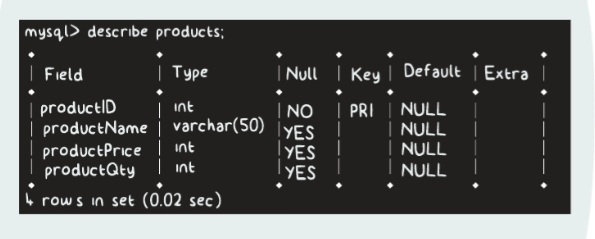
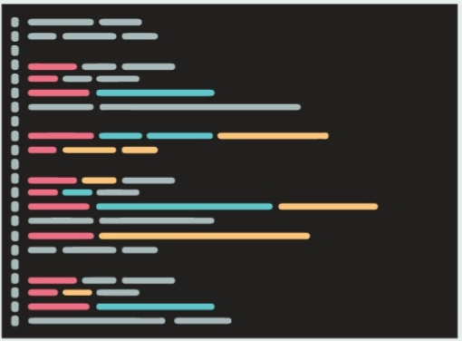
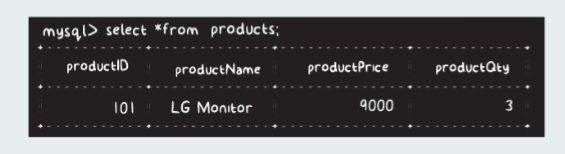

# DataBase & Table
Before we start writing any code or creating the GUI/other functionalities, let's head on to our MySQL first and create the required ProductData database and the table to store the product details.

Therefore, we will create a ProductData database with a "products" table in it. The products table will have the following fields,

productID - This field will store the product ID and will be of INT type. Since every product will have a unique ID, we will declare this field as the PRIMARY KEY.

productName - This field will store the product name and will be of VARCHAR type.

productPrice - This field will store the price of the product and will be of INT type.

productQty - This field will store the product quantity and will be of INT type.

Let's move ahead...
##Creating Table

As discussed, let's create the ProductData database in our MySQL. Hit the following command to create the ProductData database,

CREATE DATABASE ProductData;

Output

Query OK, 1 row affected

As we know, If you get the above output, this means your database has been successfully created. Still, to be sure, we can check it using the below command,

SHOW DATABASES;

Since our database ProductData is ready, let's create the products table. To do that, hit the following command,

Output

Query OK, 1 row affected

If you get the above output, this means your table has been successfully created. Here, productID is the primary key that will have a unique record for each entry in the table.

Hit the below command to check the structure of the table,

DESCRIBE products;

It should produce the below output,

Woohoo! Our Database and the Table which we will be using to store and manipulate data are ready!

Woohoo! Our Database and the Table which we will be using to store and manipulate data are ready!

Now, we can move ahead with our project and start creating the GUI and the other functionalities that will help us to interact with this Product Data database.

Next part? Refer to GUI.md file...

Next part? Refer to AddingProduct.md -> ->

