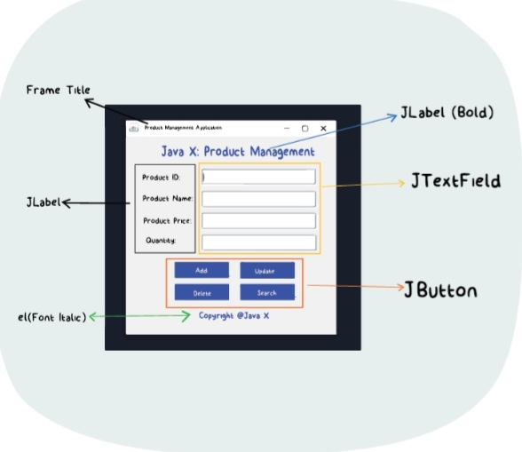
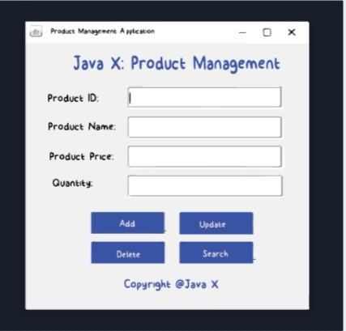
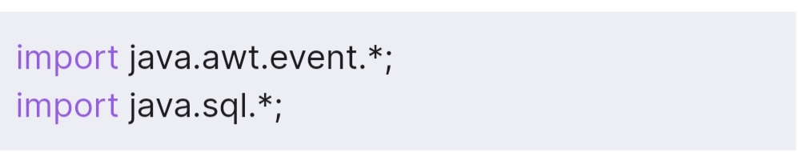
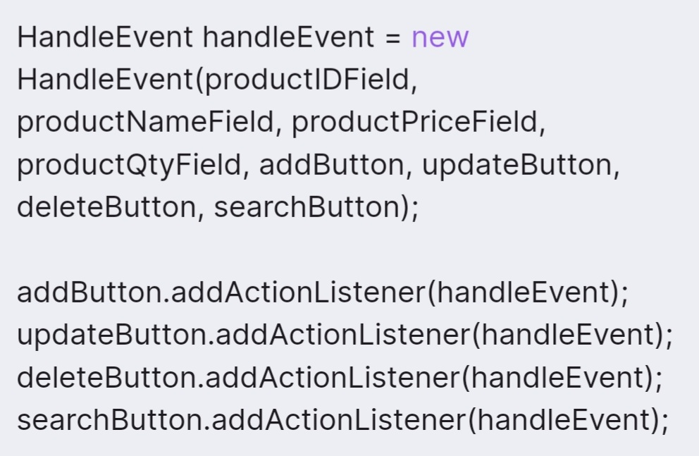
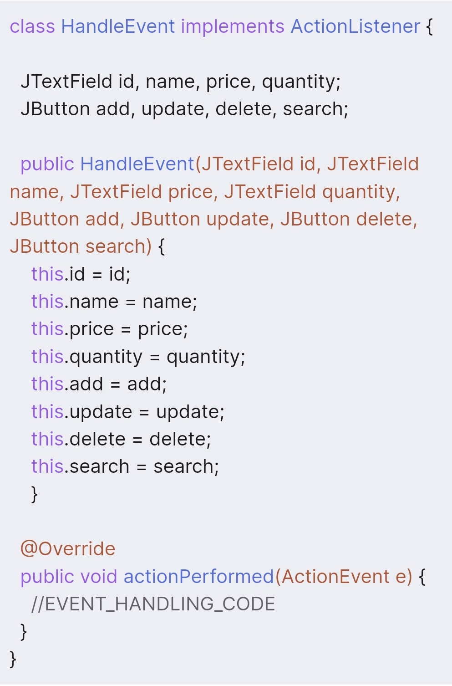
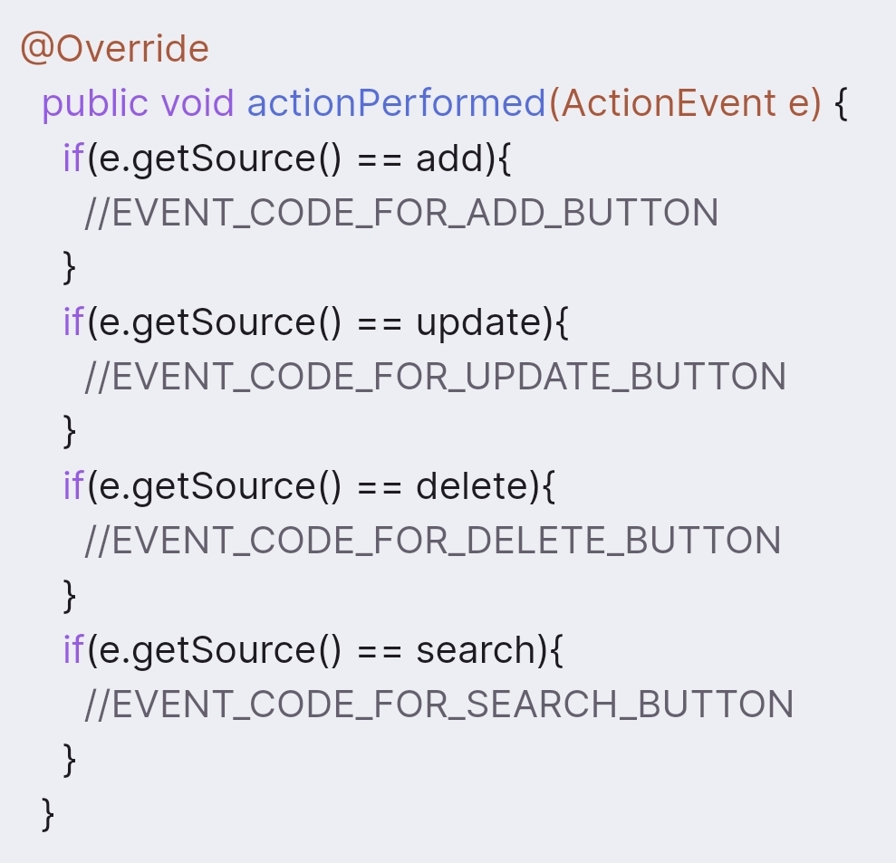
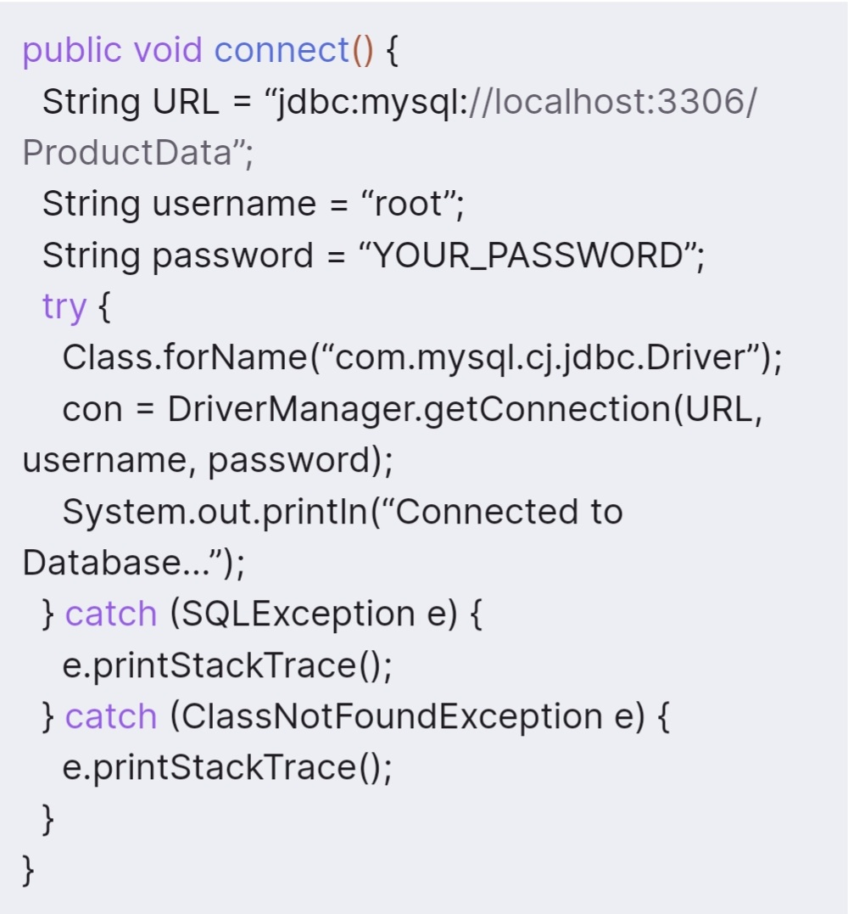

# Desired GUI

Before we actually start writing the code to develop the GUI, it will be beneficial to understand how our GUI would look.
As you can see in the above image, this is how our GUI of the application would look.
Let's identify each element over here with respect to Java Swing components.
Therefore, as you can see in the above image, we will need the following components,

JFrame

JLabel

JTextField

JButton

We have mostly worked with all of them in the Swing GUI subject.
Hence, creating a GUI similar to the above should be an easy task for you!

You can do this! At this stage of the course, you should be able to create the GUI shown in the previous screens. It's quite easy!

Just identify the GUI component, create the instance, customize it as per the requirement, and position it on the Frame. If you have completed the Swing GUI subject, it should be fairly easy...

Hence, take it as a challenge for yourself and try to clone the GUI according to the requirements of our project.
Now the code part!

Product Management CRUD App GUI
The previous code should generate the following GUI

The GUI of our Product Management software is ready! Looks beautiful, right?

Moving on to the next section, we will handle the events when any of the above buttons are clicked by the GUI and accordingly help to interact with the database by performing the required operation.

Keep going...

 refer GUI.Java file for code!

 

 Our GUI is ready and looks quite beautiful!

Now, it's time to add some functionalities and make our application interactive, and handle events. Therefore, let's move ahead, connect our application to the database, & perform the required operation according to the event invoked (button clicked).

In this section, we will create the logic for the add functionality of our application that will insert the details entered by the user into the products table of our database.

Make sure to import the given below:

## Handling the Event
We will create a new class called HandleEvent which will implement the ActionListener interface and will be 
responsible for handling events

Also, we will need to register all four buttons to listen for the event using the addActionListener() method.
When the button is clicked, we will need to grab data form all the four text fields,identify whic button was clicked, and accordingly perform the database operation.

Therefore, we will need to pass all these objects to the HandleEvent class with the help of the parameterized constructor.

Add the following additional code to the Product Management class that we have created in the previous section to register the buttons with the events listener & pass the objects to the HandleEvent class,

We pass the objects of all the buttons and the text fields while creating the instance of the HandleEvent class.
Now, let's create the HandleEven class with the appropriate constructor and the overridden actionPerformed() method,
you can explore the .Java files for code though..

### Identifying the Button

Now that we have access to the JButton's and JTextField's, we are ready to handle events.

We have learnedhow to handle events while working with GUI. But, in the GUIof this project, there are multiple buttons that can generate multiple events. So, how do we handle this situation?

Here, comes the getSource() method
The getSource() method is specified by the EventObject class that ActionEvent is a child of  and gives you a refernce to the object that the event came from. In simple words, it is used in the actionPerformed method to determine which button was clicked.
Therefore, the following is how our actionPerformed() method would look like after using the getSource() method.

Simple? We use the if statement to check whether the object returned by the getSource() method matches a particular button and accordingly execute the code block.

# Adding Product
The logic is quite simple! The very first step will be to create a database connection and get the Connection & Statement objects ready.
Once we have created the database connection, we will get the values entered by the user in teh JTextField's using teh getText() method and insert those values into the products table of our ProductData database.
The values will be dynamic in nature, hence, instead of using the Statement, we wll need to use the PreparedStatement.
Finally, once the operation is completed, we will display a dialog box with an appropreate message.

## Database Connection

Understand that, whenever any buttonis clicked, we'll need to create the database connection.
Therefore, instead of writing the same code over and over again, let's create a connect() method in the HandleEvent classs which will be responsible for creating a database connection.

Before we do that, let's declare the Connection and PreparedStatement objets at the top of the HandleEvent class and assign them a signature as 'public' and 'static'.

refer to .Java file... for the code!

### connect() Method

Below is how the connect method would look,

refer Addproduct.Java file for complete code guidance!!

Well, since our add data functionality is ready, let's try and insert some values into our database. Once you enter some data into the fields and hit the 'Add' button, above is how it would look.

Yay! It's working...

Now, let's check whether it was perfectly inserted into the database using the MySQL command line. You can hit the 'select *' statement to fetch the values and see if the data was inserted.

It should produce output something like below,

