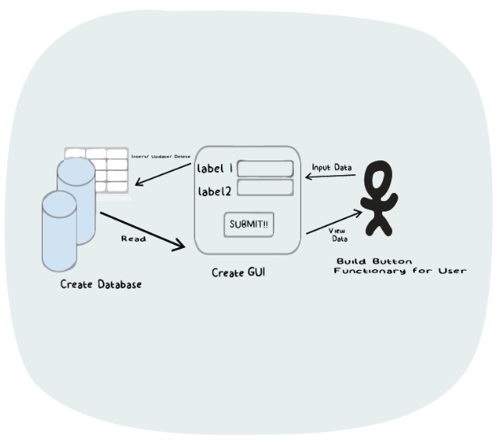
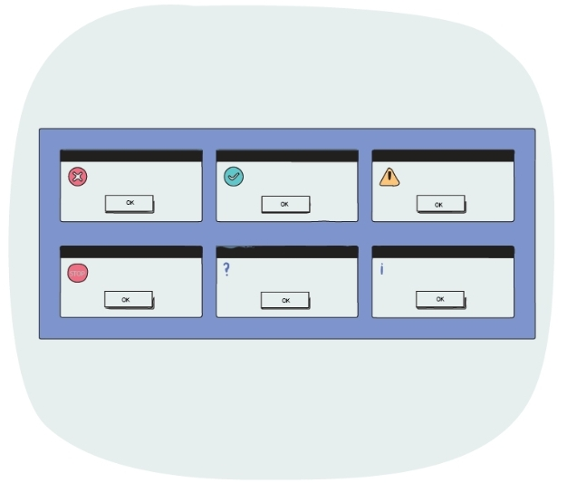
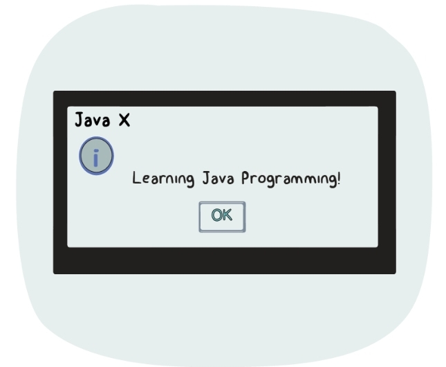

# Project3_Product-Management-Journey-8
Product Mangement CRUD App

The database is an important part of any application. Without it, an application is just like a human without a brain.
One of the most basic scenarios in real life would be a simple CRUD app that would interact with the database and help us to store and manipulate data..
But, what is a CRUD app?

CRUD is an acronym for the four basic types of operations: Create, Read, Update, Delete. A CRUD application is one that uses a GUI to get 
data in and out of a database.
And here we'll try to create a simple Product Management CRUD App that will help us interact with the database and store product details such as product id, product name, and more!

Welcome to yet another project section in our Java Programming journey. If you have completed the previous projects, then you surely know the drill.
But, this time, rather than a simple command-line appliction, we will create an amazing GUI project.

We will use all the major concepts that we have learned so far, but the focus of this project would be on understanding how to use the 
Swing GUI to communicate with the databse.

This will help you brush up your knowledge so far. This will help you enhance your skills and create a bit of an advanced-level project.
It's time to level up!

What are we going to do in this section? What is the project about?

1) Insert and store product details such as Product ID, Product Name, Product Price, and Product Quantity in the database
2) Perform various other operations such as fetching data, deleting data, updating existing data, and more
3) A simple GUI interface to perform all the above operations

*Imortant Concepts*
The project flow would be quite similar to our previous projects, but the major focus would be on implementing the project with a GUI.
*Project Flow*

Let's have a look at how the flow of our project would look like,
1) The very first step is to create a simple GUI that will help us interact with the appliction and perform operations over the database.
2) The GUI would have the following options to Add, Update, Search, and Delete the data.
3) Whenever the user hits any of these buttons, the data entered by the user will be stored/fetched from the database. Accordingly, we will also generate a dialog box that will contain the details fo the operation performed.

*The Approach*
Since the major focus would be on the GUI and the database, 
we will create a simple GUI and a database with the required table in MySQL so that our app can interact with it.
Once our GUI and database are ready, we'll handle the events that will be responsible to perform the assigned CRUD operations.
Based on the event invoked, the operation will be performed.

*JOptionPane in Swing*
In Java Swing, the JOptionPane class is used to provide std dialog boxes such as message dialog box, confirm dialog box, and input dialog box.
These can be used to display some information, or even to accept some input from the user.

This JOptionPane class is a direct subclass of JComponent and is stored in the package javax.swing
The main aim of using JOptionPane is for creating window-based applications.
These windowns are an effective way to communicate with a user without the overhead of creating a new class to represent the window,
adding components to it, and writing event-handling methods to take input.
All of these things are handled automatically by the std modal dialog boxes offered by JOprionPane class.

*Types of Dialog boxes*
1) MessageDialog
2) ConfirmDialog
3) InputDialog
4) OptionDialog

*Important Methods*

Following are some of the important methods of the JOptionPane class that you should know,

1) _static void showMessageDialog (Component parentComponent, String message, String title, int messageType):_
This method is used to create a simple message dialog to show some information.

2) _static int showConfirm Dialog (Component parentComponent, String message):_
This method is used to create a pop-up dialog box with the following three options - YES, NO, and CANCEL. 
Each option represents an integer value as 0, 1, and 2 respectively. 
It returns an integer value representing the option that is clicked by the user.

3) _static String showInputDialog(Component parentComponent, String message):_
It is used to show a question-message dialog requesting input from the user. 
This method will return a string value based on the input provided by the user.

4) _static int showOptionDialog(Component parentComponent, Object message, String title, int optionType, int messageType, Icon icon, Object[] options, Object initialValue):_

This method is like a combination of above all methods where we can create our customized dialog box as per user requirement. 
We can specify the custom options as an array.

Since these are static methods, they can be directly called using the class name as shown in the below syntax,

JOptionPane.methodName(parameters...)

_Understanding parameters_

As we have seen, there are several parameters that those methods take. Following is a quick overview of the same,

1) *Component parentComponent:* The first parameter is a component that determines the Frame in which the dialog is displayed. 
                           It can be null if the parentComponent has no Frame and hence a default Frame is used.

2) *String message and String title:* These are the string values that will be used as the message in the dialog box and 
                                 the title for the dialog box respectively

3) *int messageType:* This is a static integer value defined in the JOptionPane class that determines the type of the message & accordingly shows the relevant icon.

Following are some of the available static integer fields that can be used,

ERROR_MESSAGE

INFORMATION_MESSAGE

WARNING_MESSAGE

QUESTION_MESSAGE

- PLAIN_MESSAGE

4) *Icon icon:* It is an Icon that is displayed inside the dialog and overrides the default MessageType icon.

Let's see a simple example in exm.Java file:

output shown below:

